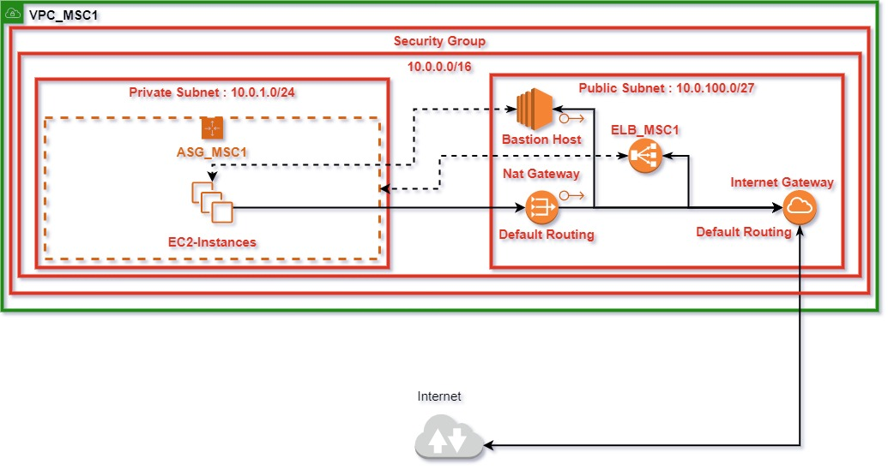
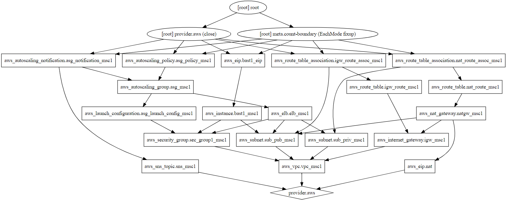

# Terraform AWS IaC
## Acceptance Criteria:
1. Include a vpc to enable future growth and scale
2. Include private and public subnet - Public for Loadbalancer, Private for Instances
3. Security Group to allow only minial ports
4. Use latest AWS AMI
5. Auto Scaling Group requirements: 2 separate volumes: 1- /, 2- /var/log, 3- Include a webserver of choice
6. Design webservers to be logged in without root key
7. Set Alarms to show if application is facing any issue
8. Not to use any tertiaty Configuration Management Tool
9. Automatically Add and Remove Nodes based on load metrics
10. Manage growth and storage of logs
## Usage:
- Change Directory to the Directory housing the terraform scirpt
- To Initialize:
> terraform init

- To Deploy:
> terraform apply -auto-approve

- To Destroy:
> terraform destroy -auto-approve
## Architecture Diagram:

## Components Breakdown:
1. **VPC**: To serve the entire Infrastructure
2. **Internet Gateway**: To provide External Connectivity form VPC
3. **Nat Gateway**: To provide Natted Connectivity to Private Instances
4. **Public Subnet**: To serve Elastic LoadBalancer and EC2 Bastion Host
5. **Private Subnet**: To serve private Instances
6. **Routing Table for Internet Gateway**: To provide default route for Internet Gateway
7. **Routing Table for Nat Gateway**: To provide default route for NAT Gateway
8. **Secutiry Group**: To grant and restrict access to Instances
9. **Launch Configuration**: To provide template for each EC2 spun up in Auto Scaling Group
10. **Auto Scaling Group**: Provide Dynamic Host Allocation
11. **Auto Scaling Policy**: To Provide Scale In/Out Policy for Auto Scaling Group
12. **Auto Scaling Notification**: To trigger Topic in context to Auto Scaling Group
13. **SNS Topic** - To provide notifications from Auto Scaling Notification
14. **Elastic LoadBalancer**: To Serve the Auto Scaling Group
15. **EC2 Instance**: To Serve as a Bastion Host to connect to Instances in Private Subnet,and the Instances in the Auto Scaling Group
16. **AWS Easltic IP**: To serve the NAT Gateway and Bastion Host
17. **Elastic Block Storage**: To Serve the Auto Scaling Group Instances and Bastion Host
## Logic:
The vpc contains two subnets, **public** to serve **LoadBalancer** and **Bastion Host**, and the **private** subnet to serve the **instances of autoscaling group**. The **Security Group** provides access to only **icmp**, **port 80**, **port 22** essential for Connectivity, Hosting and manual health checks, **443** and **8080** are added in to provide for SSL Termination and replacement of webserver respectively.

The launch configuration contains the latest **AWS HVM AMI for Amazon Linux for US-East-1(Virjinia)**. It also contains two separate ebs volumes, defined at appropriate capacities, one to be used for **root volume**, and the other to be used for **'/var/log/'**. The volume for /var/log is made to be **persistent**, which ensures retrieval of essential log data even if an instance is scrapped. The more important aspect of the Launch Configuration is that it provides **user data script**, which does a certain number of tasks:
1. Installs, Starts and Enables Apache to run on boot
2. Fetches the secondary volume, formats it as ext4(to enable journaling) and mounts it to /var/log, there by making the data persistent
3. Enables Password Authentication, Root Login, and sets the default Password

**PS** - The User Data Script can be used as **base64** encoded, **plain text is used here to accertain the Logic**

The **Auto Scaling Group** utilizes the **Launch Configuration** to deploy the instances as and when required (determined by the **auto scaling policy**)

The **Auto Scaling Notification** utilizes the sns topic to send across notifications as and when certain conditions are met, the conditions being self-explanatory

The **Elastic Load Balancer** acts as the **single point of access** to the webserver running off from the instances in the Auto Scaling Group. To facilitate that, the Elastic Load Balancer is associated with **both the public and the private subnet**. **Listeners** are set on the destination and source port of **80**, the port served by **Apache**, by **default**.

The **Bastion Host**, acts as our **point of entry** into the private subnet serving the EC2 Instances in the Auto Scaling Group. To faciliate that, the Bastion Host is provided with an **Easltic IP**

**PS:** To provide Encryption at Rest SSL Termination would have been required at ELB, since the **arn** of the Certificate is tightly coupled with the Infrastructure, I have chosen not to use it here

Two Elastic IPs are used in the entire Infrastructure:
1. Nat Gateway
2. Bastion Host

- Dot Graph showcases the build procedure followed by Terraform 

- Author: Arnab Seal - arnabseal16@gmail.com

